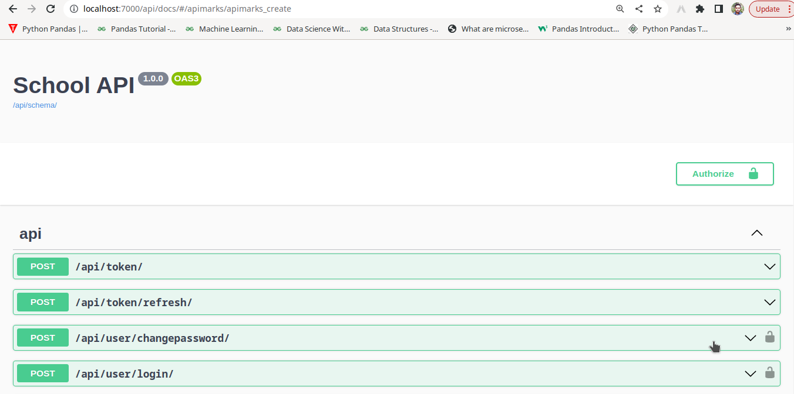
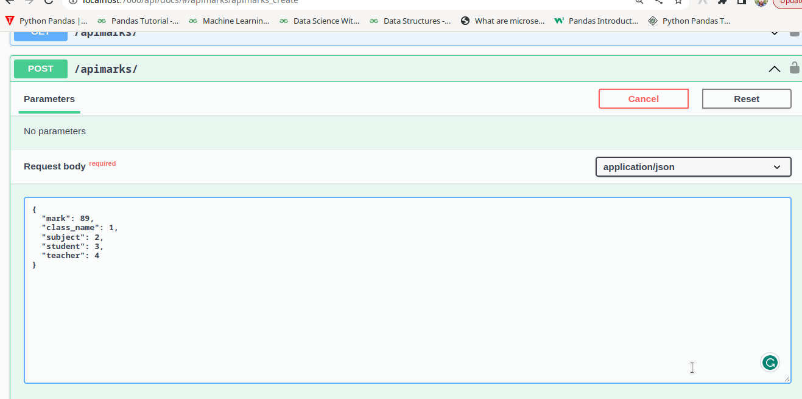
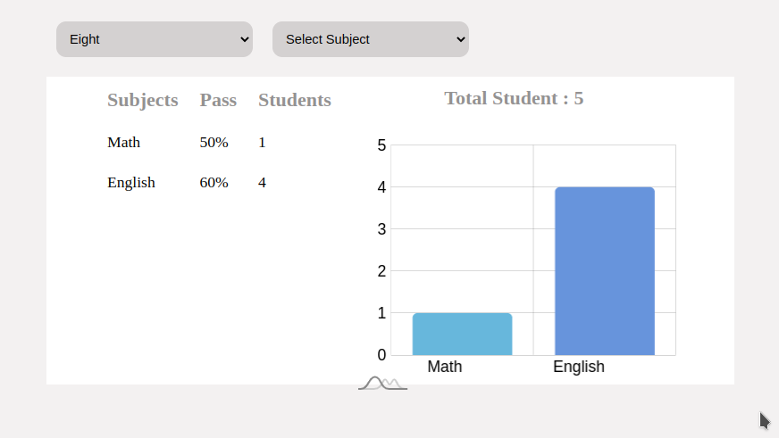
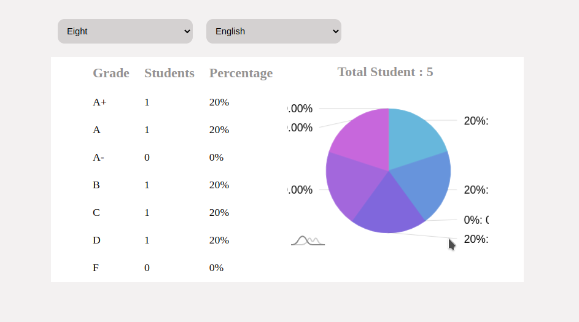

## School_Management_POC with Django, Django Rest Feamework and MongoDB

""" The project is dockerized so there is two pre prerequisite requirments """

1.Docker
2.Docker Compose 

## To Run this Project with docker follow below:

"docker-compose up --build"

the project will run at 
http://localhost:7000/

## To Run this Project without docker follow below:
```
for windows:
python -m venv env
env\Scripts\activate
pip install -r requirements.txt
python manage.py makemigrations
python manage.py migrate
python manage.py runserver
```
```
for Linux:
python3 -m venv env
sudo apt source 
source env/bin/activate
pip install -r requirements.txt
python3 manage.py makemigrations
python3 manage.py migrate
python3 manage.py runserver
```

#### There is a File link to "http://localhost:7000/api/docs/?fbclid=IwAR1M1rLXyxHO_nSYN4kneDO6Kdf41fn0L7elpTosnRQENfd3kwY0rFzsQZ4#/" which has the swagger Collection of API's which are mainly all the API's for the project 

look like below :


for example to add mark for students




Let's discuss about some key feature visualization :

1.For CRUD operations of Class,Subjects,Students,Teachers,Mark the "school" app is designed.

2.For the automated GPA Grading system you can see the Mark Model

code snippet :

class Mark(models.Model):
    GRADE_CHOICES = (
        ('5.00', 'A+'),
        ('4.00', 'A'),
        ('3.50', 'A-'),
        ('3.25', 'B'),
        ('2.00', 'C'),
        ('1.00', 'D'),
        ('0.00', 'F'),
        )
    class_name = models.ForeignKey('school.SchoolClass', on_delete=models.CASCADE, related_name='marks')
    subject = models.ForeignKey('school.Subject', on_delete=models.CASCADE, related_name='marks')
    student = models.ForeignKey('school.Student', on_delete=models.CASCADE, related_name='marks')
    teacher = models.ForeignKey('school.Teacher', on_delete=models.CASCADE, related_name='marks')
    mark = models.IntegerField()
    grade = models.CharField(max_length=5, null=True, blank=True)
    grade_point = models.FloatField(null=True, blank=True)

    def save(self, *args, **kwargs):
        if self.mark >= 80:
            self.grade = 'A+'
            self.grade_point = 5.0
        elif self.mark >= 70:
            self.grade = 'A'
            self.grade_point = 4.0
        elif self.mark >= 60:
            self.grade = 'A-'
            self.grade_point = 3.5
        elif self.mark >= 50:
            self.grade = 'B'
            self.grade_point = 3.25
        elif self.mark >= 40:
            self.grade = 'C'
            self.grade_point = 2.0
        elif self.mark >= 33:
            self.grade = 'D'
            self.grade_point = 1.0
        else:
            self.grade = 'F'
            self.grade_point = 0.0
        super().save(*args, **kwargs)

    @property
    def gpa(self):
        return self.student.marks.aggregate(avg_grade_point=Avg('grade_point'))['avg_grade_point']

    class Meta:
        ordering = ('-id',)
        verbose_name = "Mark"
        verbose_name_plural = "Marks"


3.The first dashboard summarizing results looks like :
  

4.The second dashboard summarizing results looks like :
  